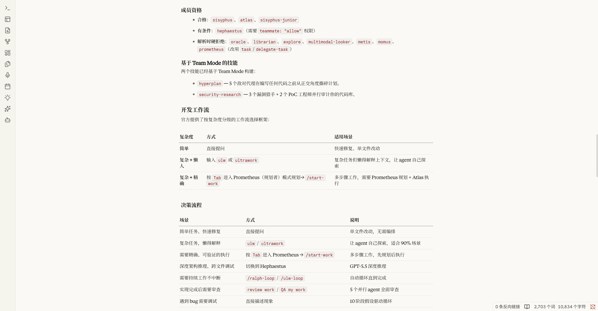

# Claude Cream for Obsidian

[English](#english) | [中文说明](#中文说明)

---

## English

**Claude Cream** is a minimal, elegant, and highly polished light theme for Obsidian, meticulously designed to replicate the warm, scholarly, and cozy aesthetic of Claude.ai.

### Features

- **Embedded Typography**: Includes full Base64-encoded web fonts (`Anthropic Serif`, `Anthropic Sans`, and `Anthropic Mono`). No internet connection or system-wide font installations required.
- **Perfect View Alignment**: The Editing View (Live Preview) and Reading View are 100% visually aligned, sharing exact layout widths (`752px`), line heights (`1.65`), spacing, margins, and typography sizes.
- **Accents & Highlights**: Integrates Claude's signature clay-orange (`#D97757`) for accent elements, hand-drawn checkbox styles, and clay-orange wavy underlines for `mark` highlights.
- **Refined Interface**: Elegant, minimal borders for cards, sidebars, tables, and callouts, resulting in a distraction-free, paper-like writing environment.

### Installation

#### Method 1: Community Themes (Recommended)
1. In Obsidian, go to **Settings** > **Appearance** > **Themes** > **Manage**.
2. Search for `Claude Cream`.
3. Click **Install and use**.

#### Method 2: Manual Installation
1. Download `theme.css` and `manifest.json` from the latest release.
2. Place them in your vault's hidden folder under `.obsidian/themes/Claude Cream/`.
3. Go to **Settings** > **Appearance** and select **Claude Cream** in the Themes dropdown.

---

## 中文说明

**Claude Cream** 是一款精美、极简且经过深度调优的 Obsidian 浅色主题。它的设计灵感来源于 Claude.ai，旨在为您提供如同实体纸张般温暖、质朴、沉浸式的学术级阅读与写作体验。

### 核心特性

- **完全内置专属字体**：内嵌 Base64 格式的 `Anthropic Serif`（正文衬线）、`Anthropic Sans`（界面无衬线）及 `Anthropic Mono`（代码等宽）字体，无需联网，离线即可 100% 渲染。
- **编辑与阅读模式完美对齐**：实时预览（Live Preview）与阅读视图（Reading View）达到 100% 视觉对齐。统一最大宽度为 `752px` 且自动居中，拥有完全相同的行高（`1.65`）、段落间距和列表对齐细节。
- **经典陶土橙设计**：融合 Claude 经典的陶土橙（Clay-Orange, `#D97757`）作为系统强调色，搭配手绘细边框复选框以及独特的陶土橙波浪下划线高亮。
- **极致卡片与排版**：对表格、引用块（Callouts）、代码块以及侧边栏边框进行了极简设计，提供最干净的卡片质感。

### 安装方法

#### 方法一：从社区主题商店安装（推荐）
1. 打开 Obsidian 的 **设置** > **外观** > **主题** > **管理**。
2. 搜索 `Claude Cream`。
3. 点击 **安装并启用**。

#### 方法二：手动安装
1. 在 Release 页面下载最新的 `theme.css` 和 `manifest.json`。
2. 将它们放进笔记仓库下的 `.obsidian/themes/Claude Cream/` 文件夹中。
3. 进入 **设置** > **外观**，在主题下拉菜单中选择 **Claude Cream** 启用。

---

## License

This theme is licensed under the [MIT License](LICENSE).
